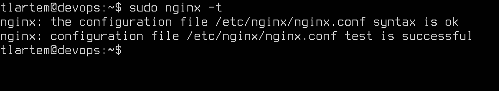

# Отчет. Лаба 1. Nginx

**Авторство: Цырульников Артём Алексеевич К3239**

## Задание:

1. Должен работать по https c сертификатом
2. Настроить принудительное перенаправление HTTP-запросов (порт 80) на HTTPS (порт 443) для обеспечения безопасного соединения.
3. Использовать alias для создания псевдонимов путей к файлам или каталогам на сервере.
4. Настроить виртуальные хосты для обслуживания нескольких доменных имен на одном сервере.
5. Что угодно еще под требования проекта 
*(P.S. проект лапочка он ничего не требует)*

## Зажигание

BTW I Use Arch, но в  этот раз все же поставлю Ubuntu Server на виртуалку чтобы не мусорить в системе.


И конечно же мущинский `neofetch`.


Дальше поставим пакетики.

```bash
sudo apt update
sudo apt install nginx -y
```

Запустим этого тигра лееее:

```bash
sudo systemctl start nginx
# Ставим на автозапуск этот видеорегистратор
sudo systemctl enable nginx
```


Включим сетевой мост на нашего тигра, чтобы сосновной системы зайти в браузер чекнуть зажигание.


Ура братья мы завелись! (Nginx теперь тоже имеет брюнетки гламур темный режим)

## Пристегиваемся и настраиваем сиденье

### В первом пункте от нас хотят соединение *https* и настроенные сертификаты. (А еще захватим перенаправление с *http*)

Купим у файла `/etc/hosts` по братски пару доменов:


Мы обманули наш компьтер, теперь он думает что мы смогли позволить себе взять доменные имена и записаться в DNS. Теперь наши тигры имеют имена. Можем обращаться по доменам.

Для обеспечения соединения по *https* нам нужно достать сертификаты, взаимодействовать с **CloudFlare** мы не хотим, просто подпишем сами.

Создадим каталоги для сертификатов чтобы все хранилось по красоте:

```bash
sudo mkdir -p /etc/nginx/ssl/tigr1
sudo mkdir -p /etc/nginx/ssl/tigr2
```

```bash
sudo openssl req -x509 -nodes -days 365 -newkey rsa:2048 \
 -keyout /etc/nginx/ssl/tigr1/tigr1.krasava.key \
 -out /etc/nginx/ssl/tigr1/tigr1.krasava.crt \
 -subj "/C=US/ST=State/L=City/O=Organization/OU=Department/CN=example.com"
```

Создаем конфиг файл для первого тигра:

`/etc/nginx/sites-available/tigr1.krasava.conf`


**Тут чуть-чуть подкрался `alias` я просто забыл заранее скрин сделать**

**Для второго мы просто циферку меняем, так что я не буду дублироваться!**

Создаем симлинки чтобы nginx знал где тигры зимуют:

```bash
sudo ln -s /etc/nginx/sites-available/tigr1.krasava.conf /etc/nginx/sites-enabled/
```

Создадим какую нибудь хтмэльку(html) заглушку:

```bash
sudo mkdir -p /var/www/project1/static
sudo nano /var/www/project1/index.html
```

Как настоящая фанатка музыки я не смог устоять:

(Во втором файлике металлика)


Проверим что мы нигде не накосячили:

```bash
sudo nginx -t
```



Слава яйцам! Перезапускаем nginx и проверяем:

```bash
sudo systemctl restart nginx
```


Мы достигли цели первого пункта, а второй захватили подарком, мне просто лень 2 раза конфиг менять. У нас работают оба проекта, а также принудительно нас перенаправляют на https.

Жаль правда браузер не дурак и видит, что мы подписали сами сертификаты и красит соединение в красный цвет :(. Токсик вайб.

### Настроим `alias` для удобного доступа к файлам на сервере

Добавим в наши конфиги данные строчки:

```nginx
location /static/ {
    alias /var/www/project1/static/;
}
```

Теперь все наши картиночки и видосики которые находятся в папке проектов можно получать с помощью простой преписки к домену `tigr.krasava/static/{file.ex}`.

Теперь с помощь `wget` скачанием какие нибудь картиночки с Всемирной Глобальной Межгалактической Сверхскоростной Паутинообразной Цифровой Инфо Передающей Связи Через Эфирное Пространство С Использованием Электромагнитных Волн Для Поддержания Беспрерывного Онлайн Доступа К Безграничному Океану Данных И Мемов.

```bash
sudo wget /var/www/project1/static/acdc.png {long hyperlink}
```


Добавим во второй проект лого металлики и можно тестить нашу красоту.

`https://tigr1.krasava/static/acdc.png`


`https://tigr2.krasava/static/metallica.jpg`


## Вывод

Собсна мы все поставили:

1. Два разных проекта хостятся на сервере с одним физ. IP. 

2. Забанили тех кто пытается использователь непровославное *http* соединение, заставили всех использовать *https*.

3. Настроили удобный доступ к статике через `alias`.

Всем спасибо за внимание! Живите кайфуте!
