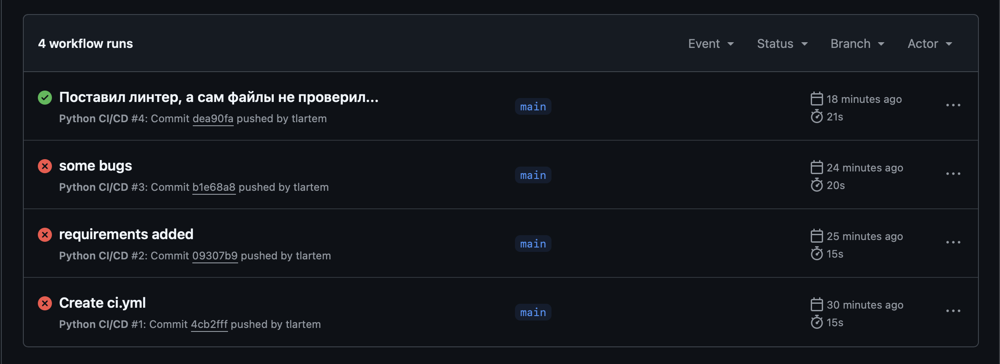

# Отчет. Лаба 3. CI/CD

## Задание:

1. Написать “плохой” CI/CD файл, который работает, но в нем есть не менее пяти “bad practices” по написанию CI/CD
2. Написать “хороший” CI/CD, в котором эти плохие практики исправлены
3. В Readme описать каждую из плохих практик в плохом файле, почему она плохая и как в хорошем она была исправлена, как исправление повлияло на результат

## Стартуем

Итак, без лишних прелюдий, потому что до дедлайна 2 часа…

Сложно было ломать CI/CD файл, но я справился.

Мое чудо:

```yaml
name: Python CI/CD

on: [push]

jobs:
  build:
    runs-on: ubuntu-latest

    steps:
    - name: Checkout code
      uses: actions/checkout@latest

    - name: Set up Python
      uses: actions/setup-python@latest

    - name: Install dependencies
      run: |
        sudo pip install -r requirements.txt

    - name: Run Linter
      run: |
        pip install flake8
        flake8 .

    - name: Run Tests
      run: |
        python test_app.py

    - name: Store Data
      run: |
        echo "Secret data" > data.txt
```

## Загибаем пальцы:

1. Использование тега `latest` — эту фишку я еще прочувствовал с прошлой лабы с файлом докера, поэтому тут же ее выделил. Опять же, нам важна стабильность CI/CD процесса. Лучше даже версию руками менять, чем так. Это как с вордом: вроде можно там отчеты писать, но как подкинет тебе приколюх… Другое дело — LaTeX.

2. `sudo` — я тут чуть-чуть походил на кружок по притягиванию за уши, ну вы видите, да? Так вот, не лезь — убьет. Непредсказуемое поведение среды, а еще дырки, дыры, дырищи в безопасности.

3. Вторая фишечная — можно представить, что там данные из ENV :). `"Secret data"` не должна быть в файле конфигурации. Данные должны храниться в безопасных хранилищах или передаваться через секреты GitHub. Иначе снова дырочки в безопасности. “Читайте мои ключики API, мне не жалко”.

4. Не хардкодим запуск тестов, используем инструменты, чтобы они сами нашли все наши тесты. Помню, однажды я так 10к элементов словаря захардкодил, когда не знал, что такое базы данных. Было больно…

5. Для полноты и понимания, насколько мы хорошо тестируем, нам нужно добавить инструменты, которые позволят определить, какие функции мы не затестили, какие участки кода не задействовали. Чтобы казусов было меньше.

6. Добавим ограничение по времени на участки кода, которые могут нас отправить в нирвану. Зачем тратить лишние ресурсы и время, если можно просто ограничить лимит времени на выполнение?

А теперь исправленный файл:

```yaml
name: Python CI/CD

on:
  push:
    branches: [main]

jobs:
  build:
    runs-on: ubuntu-latest
    timeout-minutes: 10

    steps:
    - name: Checkout code
      uses: actions/checkout@v3

    - name: Set up Python
      uses: actions/setup-python@v4
      with:
        python-version: '3.9'

    - name: Install dependencies
      run: |
        python -m pip install --upgrade pip
        pip install -r requirements.txt

    - name: Install test dependencies
      run: |
        pip install flake8 coverage

    - name: Lint code
      run: |
        flake8 .

    - name: Run Tests
      run: |
        coverage run -m unittest discover
        coverage xml
      timeout-minutes: 10

    - name: Upload Coverage Report
      uses: actions/upload-artifact@v3
      with:
        name: coverage-report
        path: coverage.xml
```

Успел закоммитить пару изменений, чтобы наглядно увидеть работу своего чада:



Да, я забыл пару файлов до того, как сделать CI файл. Но кто не учится на ошибках, тот не любит[капибар](https://drive.google.com/file/d/1Bxfq9Ity2sqii9j_rrvKAYdTlDPiNoE8/view?usp=sharing). 

Конец.